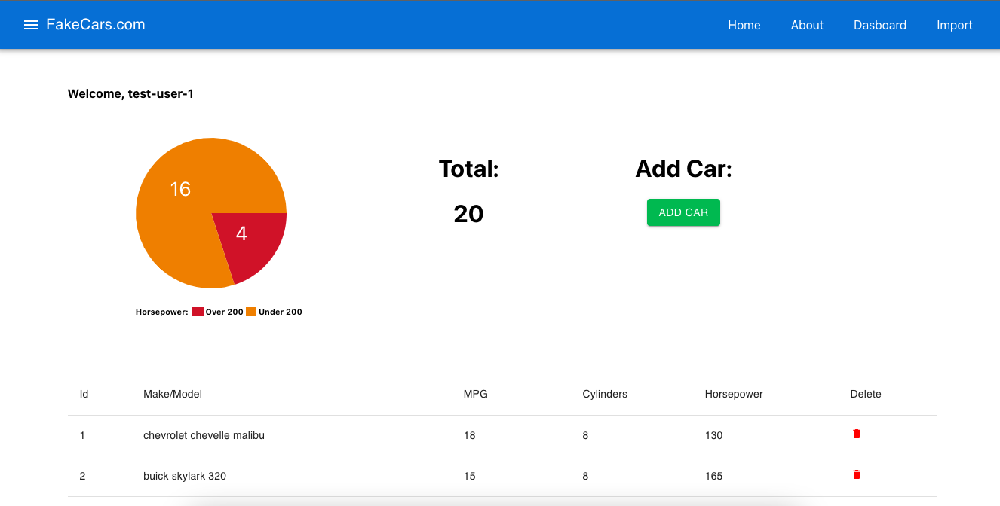
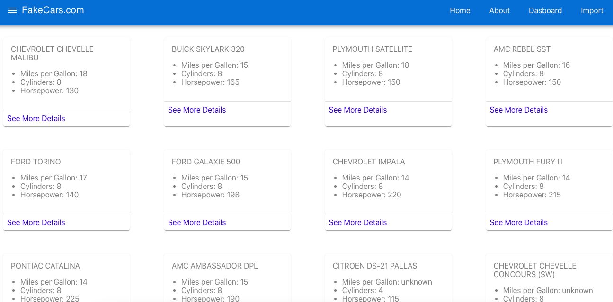

# Cars Application

## Overview

This project showcases a mock-import utility for a cars application. The application utilizes Redux Thunk to interact with an external API, which provides comprehensive data on cars.

## Features

1. **Interactive API Integration**: Implemented Redux Thunk to seamlessly fetch data from an external cars API.
2. **User Interactivity**: Incorporated functionality that allows users to delete individual car imports, ensuring a dynamic and responsive user experience.
3. **Real-time Data Monitoring**: Developed a feature to maintain and display a current count of the imported cars, providing real-time insights for users.

## Technical Stack

### Dependencies:
- **Core Frameworks**: `react`, `react-dom`
- **State Management**: `redux`, `react-redux`, `redux-thunk`
- **Navigation & Routing**: `react-router`, `react-router-dom`
- **UI & Styling**: `@mui/material`, `@mui/icons-material`, `@emotion/react`, `@emotion/styled`
- **Data Visualization**: `react-minimal-pie-chart`

### Scripts:

- **Development Server**: `npm start`
- **Build**: `npm build`
- **Testing**: `npm test`

## Visual Representation

